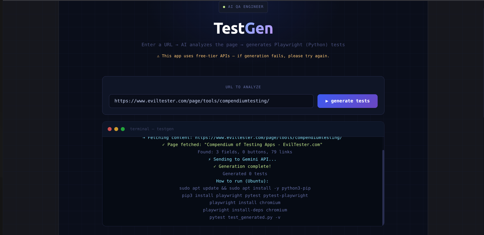

## TestGen

## Description
AI-powered test generator that analyzes any webpage and produces ready-to-run Playwright (Python) test files. 

## Demo
https://test-gen-black.vercel.app/

## Screenshot

## Tech stack
React, Vite, FastAPI, Python, Playwright, Gemini API, Vercel, Render

## Functions
- Generating tests from URL, 
- syntax highlighting,
- download .py,
- token counter

## How to launch locally
Requirements: Node.js 20+, Python 3.12+

1 step - Clone the repository 
  git clone https://github.com/willn0rd/TestGen.git
  cd TestGen
  
2 step - Backend
  python3 -m venv venv
  source venv/bin/activate
  pip install -r requirements.txt

  Create a .env file in the project root:
  GEMINI_API_KEY=your_key_here
  Get your free API key at aistudio.google.com.

  uvicorn main:app --reload

  Backend will be available at http://localhost:8000

3 step - Frontend 
  npm install

  Create a .env.local file:
  VITE_API_URL=http://localhost:8000

  npm run dev
  Frontend will be available at http://localhost:5173

## Architecture
Fronted on Vercel communicates with backend FastAPI on Render, which then proxy requests to Gemini API

## License
MIT
